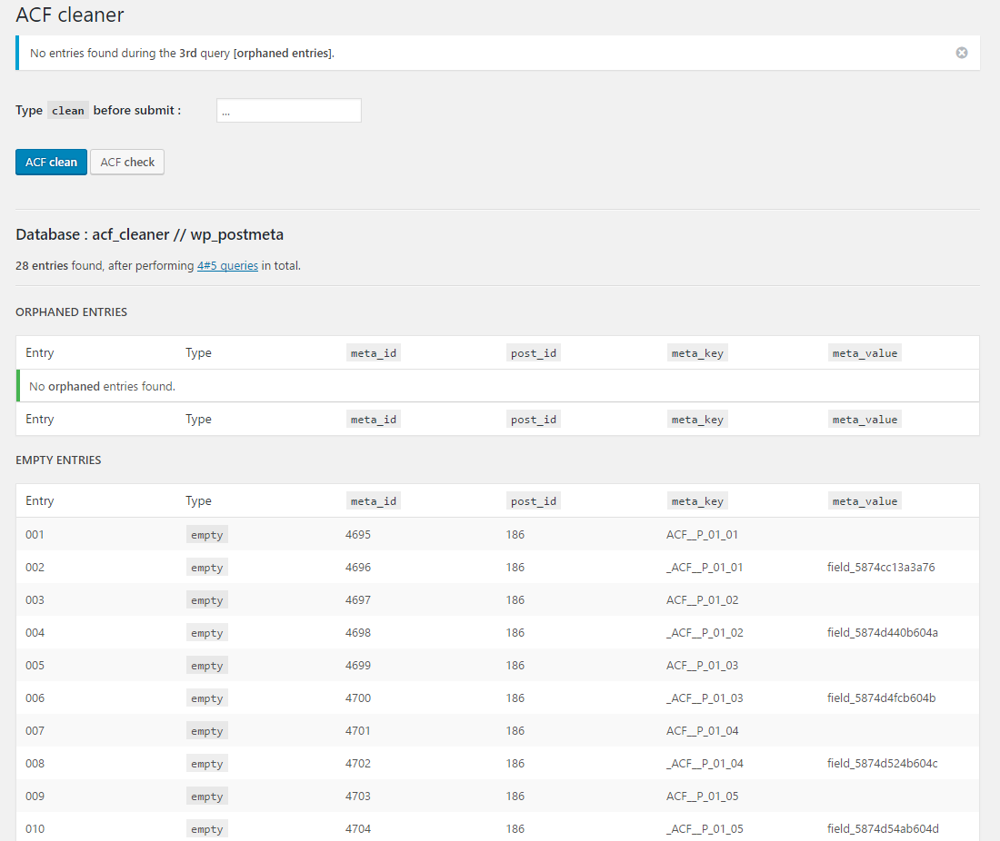

# ACF cleaner

Advanced Custom Field cleaner / remove empty and orphaned ACF entries from your WordPress database.

----------

**[Advanced Custom Fields](http://advancedcustomfields.com/)** is a WordPress plug-in that helps you creating advanced, custom fields for better content parsing through custom PHP / SQL queries.

*It works great, but has one disadvantage; it really meshes up your database.*

**Imagine this;**

You have 10 custom fields for SEO practices (description, OG:share, metadata, etc...). And those SEO fields are binded to all your (10) webpages.

But your client ( *lazy as they are* :p ) doesn't enter SEO information for every page.

In this case, ACF saves 10 empty records for every page, resulting in 100 useless database entries. And every time your client updates a page (let's say 5 times, during entering the right content), ACF creates 50 empty "revision" entries... per page; so 500 records in total.

Guess what? The site is multi-langual... 5 languages, resulting in 500 x 5 empty records; 2.500 entries without any information... and you can multiply that, because ACF creates 2 records, for every single entry (*5.000 useless records after some editing in your back-end...*).

Another thing is, that when you delete an ACF field, it related content is not deleted (this can be fine, but in most cases I want both the **field** and the (orphaned / depricated) **content** gone).

And when renaming the fields #ID (which can happen, in early stages of development) the "original" content is saved and cloned to another record... which duplicates **all** entries, created before.

...so after developing and managing your content, you can end up with thousands of useless ACF records / entries in your database.

----------

**This is where ACF cleaner comes in;**

It scans for both empty and orphaned records and removes them with one click.

###How to use?

1. I made the plug-in for my own workflow, so be aware that all your ACF fieldnames (the #ID's, not their labels) must start with `ACF__`  (case insensitive), like `ACF__myname` or `ACF__4421jaQ` or `ACF_title_1_page_3`
2. Install the plug-in at `wp-uploads/plugins` and activate it, like all plug-ins
3. Navigate to `tools/acf cleaner` and see all your empty / orphaned records (when prefixed by `ACF__`)
4. When records are found, you can **(re-) check** the database or **clean** it; simply enter `clean` in the inputfield (to prevent accidentally hitting the "ACF clean" button) and submit the form
5. When any records are encountered the plug-in will clean them and show you the results of the SQL cleaning actions

----------

**Remember; do back-up your database before cleaning, since I can not take any responsibility for the final result.**